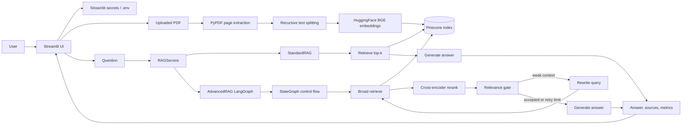
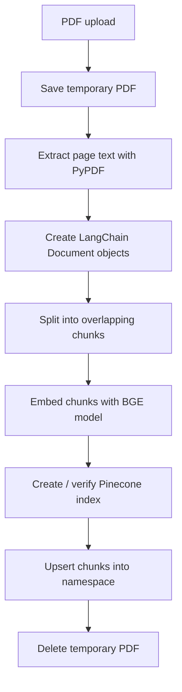
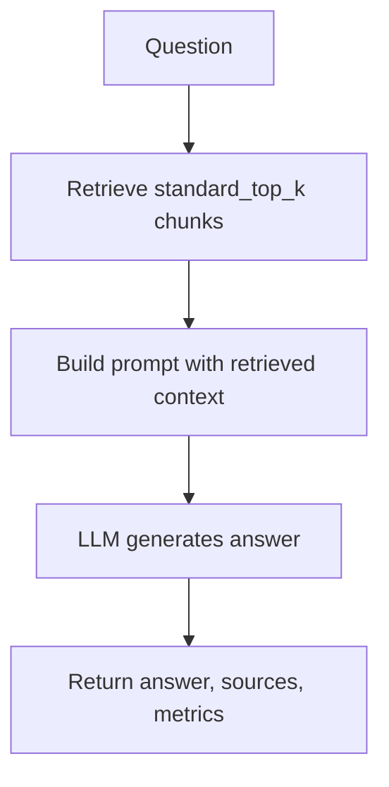
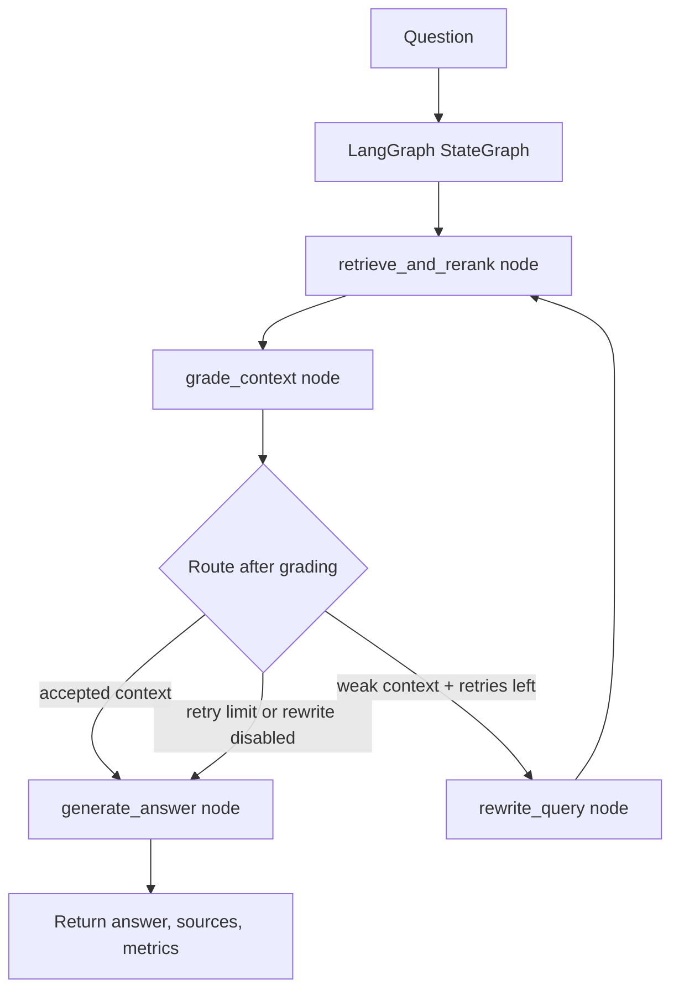

# Corrective RAG App

This repository contains a deployable Streamlit application for comparing
Standard Retrieval-Augmented Generation (Standard RAG) with an Advanced
Corrective RAG (CRAG) pipeline over user-uploaded PDF documents.

The app lets you upload a PDF, index it in Pinecone, ask questions over the
indexed content, compare Standard RAG and CRAG outputs, inspect performance
metrics, run small batch evaluations, and optionally use an LLM-as-a-judge to
score answer quality.

## Table Of Contents

- [What This App Does](#what-this-app-does)
- [What Is RAG?](#what-is-rag)
- [What Is Corrective RAG?](#what-is-corrective-rag)
- [Standard RAG vs Corrective RAG](#standard-rag-vs-corrective-rag)
- [High-Level Architecture](#high-level-architecture)
- [Project Structure](#project-structure)
- [Configuration And Secrets](#configuration-and-secrets)
- [Run Locally](#run-locally)
- [Deploy To Streamlit Community Cloud](#deploy-to-streamlit-community-cloud)
- [Data Ingestion Pipeline](#data-ingestion-pipeline)
- [Retrieval And Generation Pipelines](#retrieval-and-generation-pipelines)
- [Evaluation Metrics](#evaluation-metrics)
- [LLM-As-A-Judge](#llm-as-a-judge)
- [LangGraph Implementation](#langgraph-implementation)
- [Important Code Functions](#important-code-functions)
- [How To Interpret Whether CRAG Is Better](#how-to-interpret-whether-crag-is-better)
- [Tuning Guide](#tuning-guide)
- [Troubleshooting](#troubleshooting)

## What This App Does

The app provides a Streamlit interface around a document-grounded question
answering pipeline.

Core features:

- Upload a PDF and index its extracted text into Pinecone.
- Store document chunks in a selected Pinecone namespace.
- Ask questions using either Standard RAG or Advanced CRAG.
- Compare Standard RAG and CRAG side by side.
- View latency, retrieval, reranking, grading, generation, and source metrics.
- Run a small batch evaluation by pasting one question per line.
- Download comparison or evaluation results as CSV.
- Optionally run an LLM judge to compare Standard RAG and CRAG answers.
- Tune chunk size, overlap, top-k values, reranking, query rewriting, retries,
  relevance threshold, temperature, and fallback behavior.
- Visualize the CRAG architecture in the app's Design tab.
- List and delete Pinecone namespaces from the Manage tab.

The app is intentionally Streamlit-only so the repository stays focused on
Streamlit Community Cloud deployment.

## What Is RAG?

RAG means Retrieval-Augmented Generation.

A plain LLM answers from its model weights and prompt. A RAG system first
retrieves relevant external information, then asks the LLM to answer using that
retrieved context.

The basic RAG flow is:

```text
User question
  -> Embed or search the question
  -> Retrieve relevant document chunks
  -> Add retrieved chunks to the prompt
  -> Generate a grounded answer with sources
```

RAG is useful because it can:

- Answer from private or domain-specific documents.
- Reduce hallucination by grounding answers in retrieved text.
- Keep answers current without retraining the LLM.
- Provide source previews so the user can inspect where the answer came from.

However, Standard RAG is only as good as its retrieval step. If the retriever
returns weak or irrelevant chunks, the LLM may still produce an incomplete or
unsupported answer.

## What Is Corrective RAG?

Corrective RAG adds a control loop around retrieval.

Instead of blindly accepting the first retrieved chunks, CRAG checks whether the
retrieved context appears useful. If the context is weak, CRAG can rewrite the
query and retrieve again before generating the answer.

In this app, the CRAG pipeline adds four corrective mechanisms:

- Broad retrieval: retrieve more candidate chunks than Standard RAG.
- Reranking: score candidate chunks with a cross-encoder reranker.
- Relevance gating: decide whether the selected context is good enough.
- Query rewriting: rewrite weak queries and retry retrieval when context is not
  accepted.

The goal is not to make CRAG always longer or more complex. The goal is to make
the answer more grounded when first-pass retrieval is weak.

## Standard RAG vs Corrective RAG

| Area | Standard RAG | Advanced CRAG |
| --- | --- | --- |
| Retrieval depth | Retrieves `standard_top_k` chunks | Retrieves `advanced_broad_k` chunks |
| Reranking | No reranking in this app | Optional cross-encoder reranking |
| Relevance check | Accepts retrieved context directly | Applies score threshold and optional LLM grading |
| Query rewrite | No rewrite | Optional rewrite when context is weak |
| Retries | No retry loop | Retries up to `max_retries` |
| Latency | Usually faster | Usually slower because of reranking and retries |
| Best case | Good when initial retrieval is already strong | Good when initial retrieval needs correction |
| Risk | May answer from weak context | May over-filter, rewrite poorly, or cost more |

This is why Standard RAG can sometimes perform better. If the first retrieval
already finds the exact relevant page, Standard RAG has less overhead and may
produce a direct answer faster. CRAG helps most when retrieval quality is noisy,
the question is ambiguous, or irrelevant chunks are mixed into the top results.

## High-Level Architecture



Runtime components:

- `streamlit_app.py`: Streamlit UI, tabs, forms, controls, comparison tables,
  evaluation CSV export, and design diagrams.
- `app/config.py`: environment and secret loading through the `Settings`
  dataclass.
- `app/rag.py`: ingestion, Pinecone index setup, Standard RAG, Advanced CRAG,
  provider adapters, metrics, and LLM judge.
- LangGraph: graph runtime for the Advanced CRAG retrieval, grading, rewrite,
  and generation control flow.
- Pinecone: vector database for chunk embeddings.
- HuggingFace embeddings: default `BAAI/bge-base-en-v1.5`.
- Cross-encoder reranker: default `cross-encoder/ms-marco-MiniLM-L-6-v2`.
- LLM provider: Groq by default if configured, or Google Gemini.

## Project Structure

```text
streamlit_app.py              Streamlit Cloud entry point and UI logic
app/
  __init__.py                 Python package marker
  config.py                   Environment configuration
  rag.py                      Ingestion, retrieval, CRAG, metrics, judging
requirements.txt              Python dependencies
.env.example                  Local environment template
.streamlit/
  config.toml                 Streamlit theme/config
  secrets.toml.example        Streamlit secrets template
```

## Configuration And Secrets

For Streamlit Community Cloud, open the app settings and add the following
TOML secrets.

```toml
GOOGLE_API_KEY = "your-google-ai-studio-key"
GROQ_API_KEY = "your-groq-key"
PINECONE_API_KEY = "your-pinecone-key"
PINECONE_INDEX_NAME = "rag-index"
PINECONE_CLOUD = "aws"
PINECONE_REGION = "us-east-1"
LLM_PROVIDER = "groq"
GEMINI_MODEL = "gemini-2.5-flash"
GROQ_MODEL = "qwen/qwen3-32b"
GROQ_BASE_URL = "https://api.groq.com/openai/v1"
EMBEDDING_MODEL = "BAAI/bge-base-en-v1.5"
EMBEDDING_DIMENSION = "768"
RERANKER_MODEL = "cross-encoder/ms-marco-MiniLM-L-6-v2"
MAX_RETRIES = "2"
APP_PASSWORD = ""
```

Important notes:

- `PINECONE_API_KEY` is required.
- If `LLM_PROVIDER = "groq"`, `GROQ_API_KEY` is required.
- If `LLM_PROVIDER = "gemini"`, `GOOGLE_API_KEY` is required.
- `EMBEDDING_DIMENSION` must match the embedding model. The default
  `BAAI/bge-base-en-v1.5` uses 768 dimensions.
- `APP_PASSWORD` is optional. Set it only if you want the public app to require
  a password before use.
- Do not commit `.env` or `.streamlit/secrets.toml`.

The Streamlit app loads secrets into environment variables here:

```python
def hydrate_environment_from_streamlit(keys: Iterable[str]) -> None:
    try:
        secrets = st.secrets
        for key in keys:
            if key in secrets and str(secrets[key]).strip():
                os.environ[key] = str(secrets[key])
    except FileNotFoundError:
        return
```

The `Settings` object reads those values from the environment:

```python
@dataclass(frozen=True)
class Settings:
    google_api_key: str | None
    groq_api_key: str | None
    pinecone_api_key: str | None
    pinecone_index_name: str
    pinecone_cloud: str
    pinecone_region: str
    embedding_model: str
    embedding_dimension: int
    reranker_model: str
    llm_provider: str
    gemini_model: str
    groq_model: str
    groq_base_url: str
    max_retries: int
    upload_dir: Path
```

## Run Locally

Create a virtual environment:

```bash
python3 -m venv .venv
source .venv/bin/activate
pip install -r requirements.txt
```

Create local environment variables:

```bash
cp .env.example .env
```

Fill in `.env`, then run:

```bash
streamlit run streamlit_app.py
```

You can also use a local Streamlit secrets file:

```bash
cp .streamlit/secrets.toml.example .streamlit/secrets.toml
streamlit run streamlit_app.py
```

## Deploy To Streamlit Community Cloud

1. Push this repository to GitHub.
2. Open [Streamlit Community Cloud](https://share.streamlit.io/).
3. Select **Create app**.
4. Choose this GitHub repository.
5. Set the main file path to `streamlit_app.py`.
6. Open **Advanced settings** and select Python `3.11`.
7. Paste the TOML secrets from the [Configuration And Secrets](#configuration-and-secrets)
   section.
8. Deploy the app.

The first PDF ingestion or first Advanced CRAG query can be slower because the
embedding model and reranker may be downloaded lazily on Streamlit Cloud.

## Data Ingestion Pipeline

The ingestion pipeline turns a PDF into searchable Pinecone vectors.



### Step 1: Save Uploaded PDF

`streamlit_app.py` saves the uploaded file to a temporary path:

```python
def save_uploaded_pdf(uploaded_file) -> Path:
    with tempfile.NamedTemporaryFile(delete=False, suffix=".pdf") as temp_file:
        temp_file.write(uploaded_file.getbuffer())
        return Path(temp_file.name)
```

After ingestion finishes, the app removes the temporary file:

```python
finally:
    temp_path.unlink(missing_ok=True)
```

### Step 2: Ensure Pinecone Index Exists

`ensure_pinecone_index()` creates the Pinecone index if it does not exist,
checks the dimension, and waits until the index is ready.

```python
def ensure_pinecone_index(settings: Settings) -> None:
    _require_config(settings)
    _install_env(settings)

    pc = Pinecone(api_key=settings.pinecone_api_key)
    if not _has_pinecone_index(pc, settings.pinecone_index_name):
        pc.create_index(
            name=settings.pinecone_index_name,
            dimension=settings.embedding_dimension,
            metric="cosine",
            spec=ServerlessSpec(
                cloud=settings.pinecone_cloud,
                region=settings.pinecone_region,
            ),
        )
```

Why the dimension check matters:

- Pinecone indexes have a fixed vector dimension.
- The default embedding model returns 768-dimensional vectors.
- If the index was created with a different dimension, ingestion and retrieval
  will fail.

### Step 3: Extract PDF Text

`extract_pdf_documents()` reads each page using PyPDF and stores page metadata.

```python
def extract_pdf_documents(
    pdf_path: Path, source_name: str | None = None
) -> tuple[list[Document], int]:
    reader = PdfReader(str(pdf_path))
    documents: list[Document] = []
    source = source_name or pdf_path.name

    for index, page in enumerate(reader.pages):
        text = page.extract_text() or ""
        if text.strip():
            documents.append(
                Document(
                    page_content=text,
                    metadata={"page": index + 1, "source": source},
                )
            )

    return documents, len(reader.pages)
```

Each extracted page becomes a LangChain `Document` with:

- `page_content`: extracted text.
- `metadata.page`: page number, starting at 1.
- `metadata.source`: uploaded filename.

### Step 4: Split Pages Into Chunks

`split_documents()` uses `RecursiveCharacterTextSplitter`.

```python
def split_documents(
    documents: list[Document], chunk_size: int, chunk_overlap: int
) -> list[Document]:
    splitter = RecursiveCharacterTextSplitter(
        chunk_size=chunk_size,
        chunk_overlap=chunk_overlap,
        length_function=len,
    )
    return splitter.split_documents(documents)
```

Chunking is important because embedding entire PDF pages can be too coarse. A
good chunk size keeps enough context while still allowing retrieval to find the
specific passage that answers the question.

Current sidebar defaults:

- Chunk size: `800`
- Chunk overlap: `100`

### Step 5: Embed And Store In Pinecone

`RAGService.ingest_pdf()` coordinates extraction, splitting, embedding, and
Pinecone upsert.

```python
def ingest_pdf(
    self,
    pdf_path: Path,
    namespace: str | None = None,
    chunk_size: int = 800,
    chunk_overlap: int = 100,
    source_name: str | None = None,
) -> IngestResult:
    self._prepare()
    documents, page_count = extract_pdf_documents(pdf_path, source_name)
    if not documents:
        raise ValueError("No extractable text was found in the PDF.")

    chunks = split_documents(documents, chunk_size, chunk_overlap)
    PineconeVectorStore.from_documents(
        documents=chunks,
        embedding=self.embeddings,
        index_name=self.settings.pinecone_index_name,
        namespace=namespace or None,
    )
```

The embedding model is loaded lazily:

```python
@property
def embeddings(self) -> Any:
    with self._lock:
        if self._embeddings is None:
            from langchain_huggingface import HuggingFaceEmbeddings

            self._embeddings = HuggingFaceEmbeddings(
                model_name=self.settings.embedding_model,
                encode_kwargs={"normalize_embeddings": True},
            )
        return self._embeddings
```

The app uses normalized embeddings, which work well with Pinecone cosine
similarity.

## Retrieval And Generation Pipelines

The app has two answer pipelines:

- `StandardRAG`
- `AdvancedRAG`

Both are called through `RAGService.ask()`.

```python
def ask(
    self,
    query: str,
    mode: Literal["advanced", "standard"] = "advanced",
    namespace: str | None = None,
    params: RAGParams | None = None,
) -> RAGResult:
    if not query.strip():
        raise ValueError("Query cannot be empty.")

    params = _validate_params(params or RAGParams(max_retries=self.settings.max_retries))
    self._prepare()
    vector_store = self._vector_store(namespace)
    return self._ask_with_fallback(query.strip(), mode, vector_store, params)
```

### Standard RAG Flow



`StandardRAG.ask()` does exactly one retrieval and one generation call:

```python
def ask(self, query: str) -> RAGResult:
    metrics = QueryMetrics()
    total_start = time.perf_counter()

    retrieval_start = time.perf_counter()
    retriever = self.vector_store.as_retriever(
        search_kwargs={"k": self.params.standard_top_k}
    )
    context = retriever.invoke(query)
    metrics.retrieval_ms = _elapsed_ms(retrieval_start)
    metrics.retrieved_docs = len(context)
    metrics.final_docs = len(context)
```

It then prompts the LLM to answer using only the retrieved context:

```python
prompt = (
    "Answer the user's question using only the context below. "
    "If the context lacks the answer, state that it is missing.\n\n"
    f"Context:\n{context_str}\n\n"
    f"Question: {query}\nAnswer:"
)
```

Standard RAG is simple and fast. Its main weakness is that it does not correct
bad retrieval. Whatever comes back from Pinecone becomes the context.

### Advanced CRAG Flow



`AdvancedRAG` now implements the corrective loop with LangGraph. The graph state
is represented by `CRAGState` in `app/rag.py`:

```python
class CRAGState(TypedDict, total=False):
    original_query: str
    current_query: str
    metrics: QueryMetrics
    final_context: list[Document]
    accepted_context: bool
    rewritten_query: str | None
    retries: int
    attempt: int
    answer: str
```

The graph is built in `AdvancedRAG._build_graph()`:

```python
def _build_graph(self) -> Any:
    try:
        from langgraph.graph import END, StateGraph
    except ImportError as exc:
        raise RuntimeError(
            "LangGraph is required for Advanced CRAG. "
            "Install dependencies with `pip install -r requirements.txt`."
        ) from exc

    workflow = StateGraph(CRAGState)
    workflow.add_node("retrieve_and_rerank", self._graph_retrieve_and_rerank)
    workflow.add_node("grade_context", self._graph_grade_context)
    workflow.add_node("rewrite_query", self._graph_rewrite_query)
    workflow.add_node("generate_answer", self._graph_generate_answer)

    workflow.set_entry_point("retrieve_and_rerank")
    workflow.add_edge("retrieve_and_rerank", "grade_context")
    workflow.add_conditional_edges(
        "grade_context",
        self._graph_route_after_grading,
        {
            "rewrite_query": "rewrite_query",
            "generate_answer": "generate_answer",
        },
    )
    workflow.add_edge("rewrite_query", "retrieve_and_rerank")
    workflow.add_edge("generate_answer", END)
    return workflow.compile()
```

`AdvancedRAG.ask()` initializes the state and invokes the compiled graph:

```python
final_state = self.graph.invoke(
    {
        "original_query": query,
        "current_query": query,
        "metrics": metrics,
        "final_context": [],
        "accepted_context": False,
        "rewritten_query": None,
        "retries": 0,
        "attempt": 0,
        "answer": "",
    }
)
```

Important behavior:

- The graph starts at `retrieve_and_rerank`.
- The graph always routes from retrieval to `grade_context`.
- The route after grading is conditional.
- If context is accepted, the graph goes to `generate_answer`.
- If context is weak, retries remain, and query rewriting is enabled, the graph
  goes to `rewrite_query`, then loops back to `retrieve_and_rerank`.
- If the retry limit is reached or rewriting is disabled, the graph goes to
  `generate_answer`.
- The app retrieves broadly using `advanced_broad_k`.
- It optionally reranks using a cross-encoder.
- It keeps only `advanced_final_k` chunks for generation.
- It accepts or rejects the context using score threshold and optional LLM
  relevance grading.
- It always generates an answer at the end, even if context is weak, but the
  prompt tells the LLM to say so if the answer is unknown.

### Query Rewriting

The query rewrite step optimizes the question for vector search:

```python
def _rewrite_query(self, query: str) -> str:
    prompt = (
        "Extract keywords and concepts from this question to optimize it "
        "for vector search. Do not answer it.\n"
        f"Question: {query}\nOptimized:"
    )
    rewritten = self.llm.invoke(prompt).content.strip()
    return rewritten or query
```

This is useful when the user's natural language question is vague or contains
phrasing that does not match the document.

### Broad Retrieval And Reranking

CRAG retrieves more documents than it finally uses:

```python
docs = self.vector_store.as_retriever(
    search_kwargs={"k": self.params.advanced_broad_k}
).invoke(query)
```

Then, if reranking is enabled, the cross-encoder scores each query-document
pair:

```python
pairs = [[query, doc.page_content] for doc in docs]
scores = self.reranker.predict(pairs)
for doc, score in zip(docs, scores):
    doc.metadata["relevance_score"] = float(score)
docs.sort(key=lambda item: item.metadata["relevance_score"], reverse=True)
```

Vector search is fast and good for approximate matching. A cross-encoder is
slower but usually better at judging whether a specific chunk answers a
specific question. This is why the app uses vector search for candidate
retrieval and cross-encoder scoring for reranking.

### Relevance Gate

The relevance gate decides whether the current context should be accepted.

```python
def _context_is_relevant(
    self, query: str, context: list[Document], metrics: QueryMetrics
) -> bool:
    if not context:
        return False

    top_score, avg_score = _score_summary(context)
    metrics.top_score = top_score
    metrics.avg_score = avg_score
    if (
        self.params.relevance_threshold is not None
        and top_score is not None
        and top_score < self.params.relevance_threshold
    ):
        return False
    if not self.params.enable_llm_grading:
        return True
```

If LLM relevance grading is enabled, the app also asks the model for a
structured yes/no relevance decision:

```python
prompt = (
    "Does this context relate to the question? "
    "Return only the structured binary score.\n"
    f"Q: {query}\nContext: {context_str}"
)
grade = self.grader_llm.invoke(prompt)
return grade.binary_score.strip().lower().startswith("yes")
```

By default, LLM relevance grading is off to reduce cost and rate-limit pressure.
The app uses reranker scores and optional thresholding as a cheaper relevance
signal.

### Final Answer Generation

Both Standard RAG and CRAG instruct the LLM to answer only from context.

Advanced CRAG generation:

```python
def _generate(self, original_query: str, context: list[Document]) -> str:
    context_str = "\n\n".join(
        [
            f"[Page {doc.metadata.get('page', '?')}]: {doc.page_content}"
            for doc in context
        ]
    )
    prompt = (
        "Answer using ONLY the provided context. If unknown, say so.\n\n"
        f"Question: {original_query}\n\n"
        f"Context:\n{context_str}\n\nAnswer:"
    )
    return self.llm.invoke(prompt).content
```

The answer is returned with serialized sources:

```python
def serialize_sources(documents: list[Document]) -> list[dict[str, Any]]:
    sources: list[dict[str, Any]] = []
    for doc in documents:
        metadata = dict(doc.metadata or {})
        score = metadata.get("relevance_score")
        sources.append(
            {
                "page": metadata.get("page"),
                "source": metadata.get("source"),
                "score": round(float(score), 4) if score is not None else None,
                "preview": doc.page_content[:700],
                "content": doc.page_content,
            }
        )
    return sources
```

## Evaluation Metrics

The app records operational metrics for each answer and comparison metrics for
Standard RAG vs CRAG.

### Per-Query Metrics

These are defined in `QueryMetrics`:

```python
@dataclass
class QueryMetrics:
    total_ms: float = 0
    rewrite_ms: float = 0
    retrieval_ms: float = 0
    rerank_ms: float = 0
    grading_ms: float = 0
    generation_ms: float = 0
    retrieved_docs: int = 0
    final_docs: int = 0
    top_score: float | None = None
    avg_score: float | None = None
    accepted_context: bool = False
    rewrite_triggered: bool = False
    llm_grading_used: bool = False
    no_answer_detected: bool = False
    fallback_used: bool = False
    fallback_reason: str | None = None
```

Metric meaning:

| Metric | Meaning |
| --- | --- |
| `total_ms` | End-to-end time for retrieval, optional correction, and generation |
| `rewrite_ms` | Time spent rewriting weak queries |
| `retrieval_ms` | Time spent retrieving chunks from Pinecone |
| `rerank_ms` | Time spent scoring candidates with the cross-encoder |
| `grading_ms` | Time spent in optional LLM relevance grading |
| `generation_ms` | Time spent generating the final answer |
| `retrieved_docs` | Number of chunks retrieved from Pinecone |
| `final_docs` | Number of chunks passed to the answer-generation prompt |
| `top_score` | Highest reranker relevance score in final context |
| `avg_score` | Average reranker relevance score in final context |
| `accepted_context` | Whether the relevance gate accepted the context |
| `rewrite_triggered` | Whether CRAG rewrote the query |
| `llm_grading_used` | Whether the optional LLM relevance grader was used |
| `no_answer_detected` | Whether answer text looks like "not enough context" |
| `fallback_used` | Whether the alternate provider was used after rate limiting |
| `fallback_reason` | Error that caused fallback |

### Comparison Metrics

The Compare tab builds a side-by-side table using `comparison_rows()`.

```python
def comparison_rows(standard: RAGResult, advanced: RAGResult) -> list[dict[str, object]]:
    pairs = (
        ("Total ms", "total_ms"),
        ("Retrieval ms", "retrieval_ms"),
        ("Rerank ms", "rerank_ms"),
        ("Grading ms", "grading_ms"),
        ("Generation ms", "generation_ms"),
        ("Retrieved docs", "retrieved_docs"),
        ("Final docs", "final_docs"),
        ("Top score", "top_score"),
        ("Avg score", "avg_score"),
        ("No-answer detected", "no_answer_detected"),
        ("Fallback used", "fallback_used"),
        ("LLM grading used", "llm_grading_used"),
    )
```

It also adds:

- `Retries`: how many times CRAG retried after weak context.
- `Answer words`: rough answer length.
- `Source page overlap`: overlap between Standard RAG and CRAG source pages.

`source_page_overlap()` computes a Jaccard-style overlap:

```python
def source_page_overlap(first: RAGResult, second: RAGResult) -> float:
    first_pages = source_pages(first)
    second_pages = source_pages(second)
    if not first_pages and not second_pages:
        return 0
    union = first_pages | second_pages
    if not union:
        return 0
    return round(len(first_pages & second_pages) / len(union), 4)
```

Interpretation:

- `1.0`: both pipelines used the same page set.
- `0.0`: no source page overlap.
- Middle values: partial overlap.

This does not prove one answer is better. It tells you whether both systems are
grounding themselves in similar document regions.

### Evaluation Tab CSV Fields

The Evaluate tab runs Standard RAG and CRAG for multiple questions and exports:

- `question`
- `standard_total_ms`
- `crag_total_ms`
- `crag_retries`
- `standard_sources`
- `crag_sources`
- `crag_top_score`
- `standard_no_answer`
- `crag_no_answer`
- `source_page_overlap`
- `standard_answer_words`
- `crag_answer_words`
- `judge_winner`
- `judge_standard_score`
- `judge_crag_score`
- `judge_rationale`
- `judge_error`
- `standard_answer`
- `crag_answer`

These are useful for debugging and comparing behavior, but they are not a full
academic evaluation by themselves. For stronger evaluation, combine them with
human labels or a gold-answer dataset.

## LLM-As-A-Judge

The LLM judge compares the Standard RAG answer and the Advanced CRAG answer for
the same question.

The structured output schema is:

```python
class JudgeComparison(BaseModel):
    """LLM-as-judge comparison between Standard RAG and CRAG answers."""

    winner: str = Field(description="'standard', 'advanced', or 'tie'")
    standard_score: int = Field(description="Standard RAG score from 1 to 10")
    advanced_score: int = Field(description="Advanced CRAG score from 1 to 10")
    rationale: str = Field(description="Brief reason for the judgement")
```

The judge is called in `RAGService.judge_answers()`:

```python
def judge_answers(
    self,
    question: str,
    standard: RAGResult,
    advanced: RAGResult,
    temperature: float = 0,
) -> dict[str, Any]:
    _require_config(self.settings)
    provider, model = self._provider_model(self.settings.llm_provider)
    llm = self._llm_for(provider, temperature)
    judge_llm = llm.with_structured_output(JudgeComparison)
```

The judge sees:

- The original question.
- The Standard RAG answer.
- Up to the first 4 Standard RAG source previews.
- The Advanced CRAG answer.
- Up to the first 4 Advanced CRAG source previews.

The judging prompt is:

```python
prompt = (
    "You are judging two RAG answers for groundedness, completeness, "
    "faithfulness to sources, and directness. Prefer answers that are "
    "well-supported by the provided retrieved context. Penalize unsupported "
    "claims. Return JSON only.\n\n"
    f"Question:\n{question}\n\n"
    f"Standard RAG answer:\n{standard.answer}\n\n"
    f"Standard RAG sources:\n{standard_sources}\n\n"
    f"Advanced CRAG answer:\n{advanced.answer}\n\n"
    f"Advanced CRAG sources:\n{advanced_sources}\n\n"
    "Return winner as 'standard', 'advanced', or 'tie'."
)
```

### Judge Criteria

The judge is instructed to evaluate:

- Groundedness: Is the answer supported by retrieved context?
- Completeness: Does it answer the user's question sufficiently?
- Faithfulness to sources: Does it avoid claims not present in the provided
  source snippets?
- Directness: Is the answer focused instead of vague or evasive?

The judge should prefer the answer that is better supported by retrieved
context, not simply the answer that sounds more fluent.

### Why Use Temperature 0?

The app calls the judge with `temperature=0`:

```python
return service.judge_answers(
    question,
    standard,
    advanced,
    temperature=0,
)
```

This makes the judge more deterministic. It does not make it perfect, but it
reduces randomness when comparing repeated runs.

### Limitations Of LLM Judging

LLM-as-a-judge is useful, but it is still a proxy metric.

Known limitations:

- The judge can be biased toward longer answers.
- The judge can be biased by answer order because Standard is always shown
  before Advanced in the current prompt.
- The judge only sees the selected source previews, not the whole PDF.
- If both systems retrieved weak sources, the judge may still choose the less
  bad answer.
- If the judge model has its own blind spots, scores can be inconsistent.

Ways to make judge results more trustworthy:

- Use a fixed evaluation set of representative questions.
- Include expected answers or rubrics when available.
- Run the judge multiple times or use multiple judge models.
- Randomize answer order in a future improvement to reduce position bias.
- Compare judge results with manual human review on a sample.
- Track disagreement cases where the judge prefers an answer but sources do not
  support it.

## LangGraph Implementation

The Advanced CRAG path uses LangGraph as the runtime controller for the
corrective retrieval loop.

The dependency is declared in `requirements.txt`:

```text
langgraph==0.2.60
```

LangGraph is used only for the Advanced CRAG pipeline. Standard RAG remains a
straight retrieval-generation path because it does not need graph routing.

### Why LangGraph Here?

CRAG naturally behaves like a graph:

- Retrieve documents.
- Grade the retrieved context.
- If context is good, generate an answer.
- If context is weak, rewrite the query and retrieve again.
- Stop when context is accepted or the retry limit is reached.

That control flow is easier to reason about as named graph nodes and explicit
edges than as a hidden loop inside one large function.

### Graph State

The graph carries a typed state object called `CRAGState`.

```python
class CRAGState(TypedDict, total=False):
    original_query: str
    current_query: str
    metrics: QueryMetrics
    final_context: list[Document]
    accepted_context: bool
    rewritten_query: str | None
    retries: int
    attempt: int
    answer: str
```

State field meanings:

| Field | Purpose |
| --- | --- |
| `original_query` | The user's unchanged question |
| `current_query` | The query currently being used for retrieval |
| `metrics` | Mutable `QueryMetrics` object accumulating timings and flags |
| `final_context` | Current selected documents after retrieval and reranking |
| `accepted_context` | Boolean relevance gate result |
| `rewritten_query` | Last rewritten query, if query rewriting happened |
| `retries` | Number of rewrite/retry cycles used |
| `attempt` | Current graph retry attempt counter |
| `answer` | Final generated answer |

### Graph Nodes

The graph is built in `AdvancedRAG._build_graph()`:

```python
workflow = StateGraph(CRAGState)
workflow.add_node("retrieve_and_rerank", self._graph_retrieve_and_rerank)
workflow.add_node("grade_context", self._graph_grade_context)
workflow.add_node("rewrite_query", self._graph_rewrite_query)
workflow.add_node("generate_answer", self._graph_generate_answer)
```

The node responsibilities are:

| Node | Function | Responsibility |
| --- | --- | --- |
| `retrieve_and_rerank` | `_graph_retrieve_and_rerank()` | Retrieve broad candidates, optionally rerank, keep final docs |
| `grade_context` | `_graph_grade_context()` | Decide whether retrieved context is relevant enough |
| `rewrite_query` | `_graph_rewrite_query()` | Rewrite the original question for better vector search |
| `generate_answer` | `_graph_generate_answer()` | Generate the final context-grounded answer |

### Graph Edges

The fixed edges are:

```python
workflow.set_entry_point("retrieve_and_rerank")
workflow.add_edge("retrieve_and_rerank", "grade_context")
workflow.add_edge("rewrite_query", "retrieve_and_rerank")
workflow.add_edge("generate_answer", END)
```

This means:

- Every graph run starts with retrieval.
- Every retrieval is followed by grading.
- Every rewrite loops back into retrieval.
- Generation is the terminal node.

### Conditional Routing

The important decision happens after `grade_context`.

```python
workflow.add_conditional_edges(
    "grade_context",
    self._graph_route_after_grading,
    {
        "rewrite_query": "rewrite_query",
        "generate_answer": "generate_answer",
    },
)
```

The router function is:

```python
def _graph_route_after_grading(self, state: CRAGState) -> str:
    if state.get("accepted_context"):
        return "generate_answer"
    if state.get("attempt", 0) >= self.params.max_retries:
        return "generate_answer"
    if not self.params.enable_query_rewrite:
        return "generate_answer"
    return "rewrite_query"
```

Routing logic:

- Accepted context goes directly to answer generation.
- Weak context goes to query rewrite only if retry budget remains.
- If retries are exhausted, the graph still generates an answer from the best
  available context.
- If query rewriting is disabled, the graph does not loop.

### Graph Node Code

The retrieval node:

```python
def _graph_retrieve_and_rerank(self, state: CRAGState) -> CRAGState:
    metrics = state["metrics"]
    final_context = self._retrieve_and_rerank(state["current_query"], metrics)
    metrics.final_docs = len(final_context)
    return {
        "metrics": metrics,
        "final_context": final_context,
    }
```

The grading node:

```python
def _graph_grade_context(self, state: CRAGState) -> CRAGState:
    metrics = state["metrics"]
    relevant = self._context_is_relevant(
        state["current_query"],
        state.get("final_context", []),
        metrics,
    )
    metrics.accepted_context = relevant
    return {
        "metrics": metrics,
        "accepted_context": relevant,
    }
```

The rewrite node:

```python
def _graph_rewrite_query(self, state: CRAGState) -> CRAGState:
    metrics = state["metrics"]
    rewrite_start = time.perf_counter()
    rewritten_query = self._rewrite_query(state["original_query"])
    metrics.rewrite_ms += _elapsed_ms(rewrite_start)
    metrics.rewrite_triggered = True
    return {
        "current_query": rewritten_query,
        "rewritten_query": rewritten_query,
        "retries": state.get("retries", 0) + 1,
        "attempt": state.get("attempt", 0) + 1,
        "metrics": metrics,
    }
```

The generation node:

```python
def _graph_generate_answer(self, state: CRAGState) -> CRAGState:
    metrics = state["metrics"]
    generation_start = time.perf_counter()
    answer = self._generate(
        state["original_query"],
        state.get("final_context", []),
    )
    metrics.generation_ms = _elapsed_ms(generation_start)
    return {
        "answer": answer,
        "metrics": metrics,
    }
```

### End-To-End Graph Invocation

`AdvancedRAG.ask()` creates the initial state, invokes the compiled graph, then
turns the final state into a `RAGResult`.

```python
final_state = self.graph.invoke(
    {
        "original_query": query,
        "current_query": query,
        "metrics": metrics,
        "final_context": [],
        "accepted_context": False,
        "rewritten_query": None,
        "retries": 0,
        "attempt": 0,
        "answer": "",
    }
)
```

After the graph returns, `AdvancedRAG.ask()` extracts:

- `metrics`
- `answer`
- `final_context`
- `rewritten_query`
- `retries`

and returns the same `RAGResult` shape used by the Streamlit UI.

### Why The UI Did Not Need To Change

The Streamlit app still calls:

```python
result = service.ask(
    question,
    mode=mode,
    namespace=normalize_namespace(namespace),
    params=params,
)
```

`RAGService._ask_with_provider()` still chooses Standard RAG or Advanced CRAG:

```python
if mode == "standard":
    return StandardRAG(llm, vector_store, params, provider, model).ask(query)
return AdvancedRAG(
    llm,
    self.reranker,
    vector_store,
    params,
    provider,
    model,
).ask(query)
```

Because `AdvancedRAG.ask()` still returns `RAGResult`, the UI, comparison tab,
evaluation tab, history tab, and LLM judge continue to work without interface
changes.

## Important Code Functions

This section maps the main functions/classes to their roles.

### `Settings.from_env()`

Location: `app/config.py`

Purpose: load configuration from environment variables.

```python
@classmethod
def from_env(cls) -> "Settings":
    return cls(
        google_api_key=os.getenv("GOOGLE_API_KEY"),
        groq_api_key=os.getenv("GROQ_API_KEY"),
        pinecone_api_key=os.getenv("PINECONE_API_KEY"),
        pinecone_index_name=os.getenv("PINECONE_INDEX_NAME", "rag-index"),
        pinecone_cloud=os.getenv("PINECONE_CLOUD", "aws"),
        pinecone_region=os.getenv("PINECONE_REGION", "us-east-1"),
        embedding_model=os.getenv("EMBEDDING_MODEL", "BAAI/bge-base-en-v1.5"),
        embedding_dimension=_int_from_env("EMBEDDING_DIMENSION", 768),
        reranker_model=os.getenv(
            "RERANKER_MODEL", "cross-encoder/ms-marco-MiniLM-L-6-v2"
        ),
        llm_provider=os.getenv("LLM_PROVIDER", "gemini").strip().lower(),
        gemini_model=os.getenv("GEMINI_MODEL", "gemini-2.5-flash"),
        groq_model=os.getenv("GROQ_MODEL", "qwen/qwen3-32b"),
        groq_base_url=os.getenv(
            "GROQ_BASE_URL", "https://api.groq.com/openai/v1"
        ).rstrip("/"),
        max_retries=_int_from_env("MAX_RETRIES", 2),
        upload_dir=Path(os.getenv("UPLOAD_DIR", "/tmp/corrective-rag/uploads")),
    )
```

### `RAGParams`

Location: `app/rag.py`

Purpose: store user-tunable retrieval and CRAG parameters.

```python
@dataclass
class RAGParams:
    standard_top_k: int = 15
    advanced_broad_k: int = 40
    advanced_final_k: int = 5
    max_retries: int = 2
    temperature: float = 0
    relevance_threshold: float | None = None
    enable_reranking: bool = True
    enable_query_rewrite: bool = True
    enable_llm_grading: bool = False
    use_fallback: bool = False
```

### `RAGResult`

Location: `app/rag.py`

Purpose: common response object returned by both Standard RAG and CRAG.

```python
@dataclass
class RAGResult:
    answer: str
    sources: list[dict[str, Any]]
    mode: str
    provider: str
    model: str
    metrics: dict[str, Any]
    params: dict[str, Any]
    rewritten_query: str | None = None
    retries: int = 0
```

### `CRAGState`

Location: `app/rag.py`

Purpose: define the state object passed between LangGraph nodes in the Advanced
CRAG pipeline.

```python
class CRAGState(TypedDict, total=False):
    original_query: str
    current_query: str
    metrics: QueryMetrics
    final_context: list[Document]
    accepted_context: bool
    rewritten_query: str | None
    retries: int
    attempt: int
    answer: str
```

### `AdvancedRAG._build_graph()`

Location: `app/rag.py`

Purpose: create and compile the LangGraph `StateGraph` that controls the CRAG
retrieve, grade, rewrite, and generate loop.

```python
def _build_graph(self) -> Any:
    try:
        from langgraph.graph import END, StateGraph
    except ImportError as exc:
        raise RuntimeError(
            "LangGraph is required for Advanced CRAG. "
            "Install dependencies with `pip install -r requirements.txt`."
        ) from exc

    workflow = StateGraph(CRAGState)
    workflow.add_node("retrieve_and_rerank", self._graph_retrieve_and_rerank)
    workflow.add_node("grade_context", self._graph_grade_context)
    workflow.add_node("rewrite_query", self._graph_rewrite_query)
    workflow.add_node("generate_answer", self._graph_generate_answer)

    workflow.set_entry_point("retrieve_and_rerank")
    workflow.add_edge("retrieve_and_rerank", "grade_context")
    workflow.add_conditional_edges(
        "grade_context",
        self._graph_route_after_grading,
        {
            "rewrite_query": "rewrite_query",
            "generate_answer": "generate_answer",
        },
    )
    workflow.add_edge("rewrite_query", "retrieve_and_rerank")
    workflow.add_edge("generate_answer", END)
    return workflow.compile()
```

### `AdvancedRAG._graph_route_after_grading()`

Location: `app/rag.py`

Purpose: choose the next LangGraph node after relevance grading.

```python
def _graph_route_after_grading(self, state: CRAGState) -> str:
    if state.get("accepted_context"):
        return "generate_answer"
    if state.get("attempt", 0) >= self.params.max_retries:
        return "generate_answer"
    if not self.params.enable_query_rewrite:
        return "generate_answer"
    return "rewrite_query"
```

### `GroqChatModel`

Location: `app/rag.py`

Purpose: small OpenAI-compatible adapter for Groq chat completions.

```python
class GroqChatModel:
    """Small OpenAI-compatible Groq adapter for the calls used in this app."""

    def invoke(self, prompt: str) -> ChatResponse:
        payload = {
            "model": self.model,
            "messages": [
                {
                    "role": "system",
                    "content": (
                        "Answer directly and do not include hidden reasoning, "
                        "chain-of-thought, or <think> blocks."
                    ),
                },
                {"role": "user", "content": prompt},
            ],
            "temperature": self.temperature,
        }
```

The adapter also handles short Groq rate-limit retry delays:

```python
if response.status_code == 429:
    retry_after = _retry_after_seconds(response)
    if retry_after is not None and retry_after <= 20:
        time.sleep(retry_after + 0.5)
        response = self._post(payload)
```

### `StructuredGroqChatModel`

Location: `app/rag.py`

Purpose: ask Groq for JSON output that matches a Pydantic schema.

```python
class StructuredGroqChatModel:
    def invoke(self, prompt: str) -> BaseModel:
        structured_prompt = (
            "Return only a valid JSON object matching this schema. "
            "Do not include markdown or extra text.\n"
            f"Schema fields: {list(self.schema.model_fields.keys())}\n\n"
            f"{prompt}"
        )
        content = self.llm.invoke(structured_prompt).content.strip()
        return self.schema.model_validate_json(content)
```

This powers both CRAG relevance grading and LLM-as-a-judge when Groq is the
active provider.

### `RAGService._llm_for()`

Location: `app/rag.py`

Purpose: load and cache the selected LLM provider.

```python
def _llm_for(self, provider: str, temperature: float) -> Any:
    provider = provider.strip().lower()
    model = self.settings.groq_model if provider == "groq" else self.settings.gemini_model
    key = (provider, model, round(float(temperature), 3))
    with self._lock:
        if key not in self._llms:
            if provider == "groq":
                self._llms[key] = GroqChatModel(...)
            else:
                from langchain_google_genai import ChatGoogleGenerativeAI
                self._llms[key] = ChatGoogleGenerativeAI(...)
        return self._llms[key]
```

### `RAGService._ask_with_fallback()`

Location: `app/rag.py`

Purpose: optionally switch providers when the active provider hits quota or
rate limits.

```python
def _ask_with_fallback(
    self,
    query: str,
    mode: Literal["advanced", "standard"],
    vector_store: PineconeVectorStore,
    params: RAGParams,
) -> RAGResult:
    provider = self.settings.llm_provider
    try:
        return self._ask_with_provider(query, mode, vector_store, params, provider)
    except Exception as exc:
        fallback_provider = self._fallback_provider(provider)
        if not params.use_fallback or not fallback_provider or not _is_rate_limit_error(exc):
            raise
```

Fallback is only used when:

- The sidebar option is enabled.
- The alternate provider API key is configured.
- The error looks like quota, rate limit, or HTTP 429.

### `render_system_design()`

Location: `streamlit_app.py`

Purpose: display the architecture and CRAG control-flow diagrams in the Design
tab using Mermaid.

```python
def render_mermaid(source: str) -> None:
    st.markdown(f"```mermaid\n{source}\n```")
```

## How To Interpret Whether CRAG Is Better

CRAG is better when it improves answer quality enough to justify the extra
latency and complexity.

Do not judge only from one question. Use a question set.

Recommended evaluation process:

1. Build a representative question set.
   Include direct factual questions, broad summary questions, ambiguous
   questions, and questions whose answer is not in the PDF.

2. Run Standard RAG and CRAG on the same questions.
   Use the Compare tab for single questions and the Evaluate tab for batches.

3. Inspect answer groundedness manually.
   Open the source expanders and check whether the answer is actually supported
   by the retrieved pages.

4. Use LLM judge as a helper, not as the only truth.
   Treat judge results as a scalable first pass. Confirm a sample manually.

5. Look at both quality and cost.
   CRAG may win on groundedness but lose on latency. That tradeoff may still be
   worth it for high-stakes answers.

6. Watch no-answer behavior.
   A good RAG system should say when the document does not contain the answer.
   It should not invent unsupported facts.

Good signs for CRAG:

- Higher judge score on groundedness and faithfulness.
- Sources are more focused on the right pages.
- Fewer unsupported claims.
- Better no-answer behavior when the answer is missing.
- Reranker `top_score` is strong and source previews match the question.

Warning signs:

- CRAG is slower but not more accurate.
- Query rewriting changes the intent of the question.
- CRAG retrieves fewer but less useful chunks.
- The LLM judge prefers fluent answers that are not source-supported.
- CRAG repeatedly triggers retries, increasing latency without improving
  sources.

## Tuning Guide

Use the sidebar controls to tune behavior.

### Chunk Size

Default: `800`

Smaller chunks:

- Better for precise retrieval.
- May lose surrounding context.
- Can create more vectors.

Larger chunks:

- Preserve more context.
- Can dilute relevance.
- May make prompts longer.

### Chunk Overlap

Default: `100`

Overlap helps preserve context across chunk boundaries. Too much overlap creates
duplicate chunks and can make retrieval repetitive.

### Standard Top K

Default: `15`

This controls how many chunks Standard RAG passes directly to the LLM.

Raise it when answers require broad context. Lower it when answers are noisy or
the prompt gets too large.

### CRAG Broad K

Default: `40`

This controls how many candidates CRAG retrieves before reranking.

Raise it when relevant content is often missed. Lower it when latency is too
high.

### CRAG Final Docs

Default: `5`

This controls how many reranked chunks are passed to the final answer prompt.

Raise it for synthesis questions. Lower it for precise factual questions.

### CRAG Max Retries

Default: from `MAX_RETRIES`, commonly `2`

Higher values allow more correction attempts but increase cost and latency.

### Temperature

Default: `0`

Use low temperature for grounded QA. Higher values can make answers more
creative but less consistent.

### Reranking

Default: enabled

Reranking usually improves source quality but adds latency because every
candidate query-document pair must be scored.

### Query Rewrite

Default: enabled

Query rewriting helps when the first retrieval is weak. Disable it if rewrites
change the meaning of the user's question.

### LLM Relevance Grading

Default: disabled

Enable it when you want a fuller corrective loop. Keep it disabled when quota or
latency is a concern.

### Score Threshold

Default: disabled

Use this only after observing typical reranker score ranges for your data.
Cross-encoder scores are model-specific and not normalized probabilities.

### Fallback Provider

Default: disabled

If enabled, the app can switch from Groq to Gemini or Gemini to Groq when the
active provider is rate-limited and the alternate key exists.

## Troubleshooting

### The app says configuration is missing

Check Streamlit secrets or `.env`.

Required:

- `PINECONE_API_KEY`
- `GROQ_API_KEY` if using Groq
- `GOOGLE_API_KEY` if using Gemini

### Gemini quota or Groq rate limit errors

429 errors mean the provider is limiting requests.

Options:

- Wait and retry.
- Reduce batch evaluation size.
- Disable LLM relevance grading.
- Disable LLM judge for batch runs.
- Enable fallback provider if the alternate key is configured.
- Use a provider/model plan with higher quota.

### Pinecone dimension error

The Pinecone index dimension must match `EMBEDDING_DIMENSION`.

For the default embedding model:

```toml
EMBEDDING_MODEL = "BAAI/bge-base-en-v1.5"
EMBEDDING_DIMENSION = "768"
```

If you change embedding models, create a new Pinecone index or ensure the
existing index uses the new dimension.

### PDF ingestion finds no text

Some PDFs contain scanned images instead of extractable text. PyPDF cannot OCR
image-only PDFs. Use a text-based PDF or add OCR preprocessing in a future
improvement.

### Standard RAG is outperforming CRAG

That can be normal.

Common reasons:

- The question is simple and first-pass retrieval is already correct.
- CRAG final docs is too low.
- CRAG broad k is retrieving noisy candidates.
- The reranker score threshold is too strict.
- Query rewriting changed the original question's intent.
- LLM relevance grading introduced extra cost without improving routing.

Try:

- Increase `CRAG final docs`.
- Disable score threshold.
- Disable query rewrite for direct factual questions.
- Compare source previews, not just the final prose.

## Commit And Push

After editing or testing locally:

```bash
git add -A
git commit -m "Document LangGraph CRAG implementation"
git pull --rebase origin main
git push origin main
```
